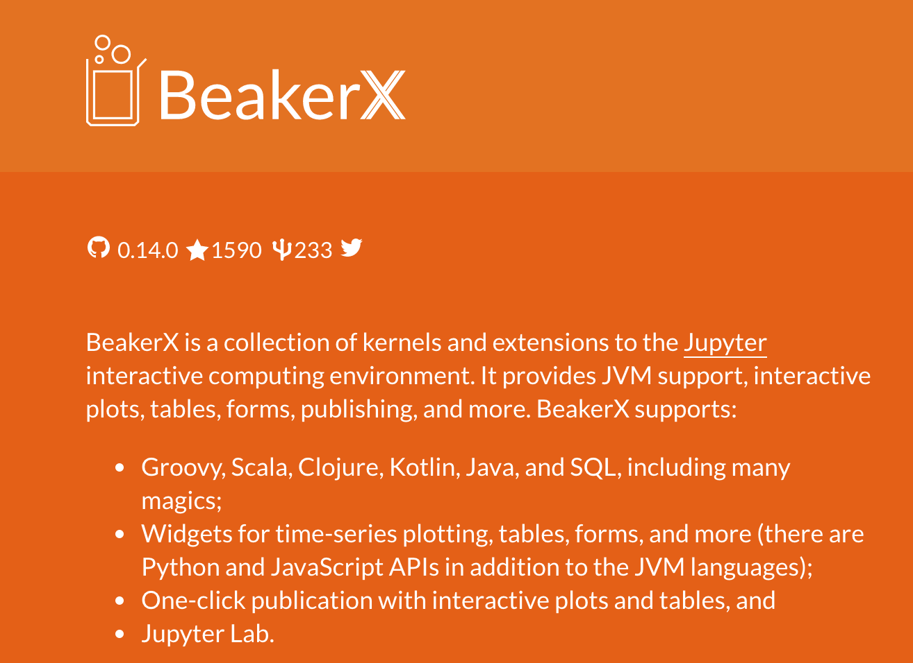

class: middle, inverse


<!-- ## Outline -->
# Outline

### Ingredients for data science?
### Table Wrangling
### Beyond Tables
### Data Visualization
### Reporting & Notebooks

---

class: middle, inverse

### Outline

# Ingredients for data science?
### Table Wrangling
### Beyond Tables
### Data Visualization
### Reporting & Notebooks

---
# The data-science life cycle

.center[]


* Python: `pandas` + `scikit-learn` + `matplotlib`/`seaborn` + `jupyter`
* R: `readr` + `tidyr` + `dplyr` + `ggplot` + `caret`/`broom` + `ggplot2` + `knitr`
* JVM, and Kotlin in particular?


???

from https://www.kdnuggets.com/2017/05/42-essential-quotes-data-science-thought-leaders.html
> half hacker, half analyst, they use data to build products and find insights

or
>> Data Scientist (n.): Person who is better at statistics than
any software engineer and better at software engineering than any
statistician.


https://blog.modeanalytics.com/python-data-visualization-libraries/

better package

http://jules32.github.io/2016-07-12-Oxford/dplyr_tidyr

.footnote[
<!-- http://jules32.github.io/2016-07-12-Oxford/dplyr_tidyr -->
https://goo.gl/wfmZrN
]

.footnote[
DSL talk: Frederico Tomasetti
https://github.com/Kotlin/KEEP/issues/75

https://github.com/Kotlin/KEEP/blob/scripting/proposals/scripting-support.md
]


---
background-image: url(images/kotlin_logo.jpg)
background-position: center
background-repeat: no-repeat
background-size: 80%

# Since February 2016

.left-column40[

Kotlin v1.0 released

#### Type Inference
#### Extension Functions
#### Data Classes
#### DSLs in Mind
#### Default Parameters
#### Lives in JVM
#### Scripting Support

]

--

.right-column60[

.right[
Data Science Requirements
## Proper Dependency Model 
## Scales from idea to product 
## Teachable 
## Rapid Prototyping 
]
]

???

somewhen in early 2016 god seemed to have heard our prays, and gave us kotlin.

release day 15.2.

what a beauty!

teachable: less than python or r, but better tooling

So can we build data science libraries with? Originally answer not really.
Language seemed nice, but no library support.


---
# Can we build data science APIs with Kotlin?


Why should we?

* Reproducibility, Dependencies & Scalability: Java
* Prototyping & Community: R & Python


Language requirements
* Can we express typical data problem?
* Core concepts untyped data (json, tsv, unstructured)?

For detailed arguments see [kscript @ kotlin-conf slides](https://holgerbrandl.github.io/kscript_kotlinconf_2017/kscript_kotlinconf.html).

So can we?

--

### We wont' know without trying!


---
## Use what's out there! == more time for the gym!

Use data classes and go with the stdlib:
```kotlin
data class User(val firstName: String?, val lastName: String, 
                val age: Int, val hasSudo: Boolean?)

val users = users.rowsAs<User>()

val groupBy: Map<Int, List<User>> = users.groupBy { it.age }
groupBy.map { it.value.size } // #  users with same age 

// https://kotlinlang.org/api/latest/jvm/stdlib/kotlin.collections/-grouping/
val groupingBy = users.groupingBy { it.age }
groupingBy.eachCount()

val complexGrouping = users.groupingBy { listOf(it.age, it.hasSudo) }
complexGrouping.eachCount()
```

More advanced slicing possible with https://github.com/thomasnield/kotlin-statistics

Does not seem enough to be fun!

---
## To type or not to type?

* Types are cool, but most data has no type
* It's more robust/fun to use types and they allow for better design
* Many data attributes are very fluent

```kotlin
data class Employee(val id:Int, val name:String) 
val staffStats = listOf(Employee("John"), Employee("Anna"))  
    ... predictNumSickDays()     // new type!
    ... addPerformanceMetrics()  // new type!
    ... addSalaries()            // new type!
    ... correlationAnalysis()    // odd generic signature :-|
```
* R/python lack strict typing, and make such workflows fun to write

```r
staff %>% 
    mutate(sick_days=predictSD(name)) %>% # table with another column
    left_join(userPerf) %>%               # and some more columns
    left_join(salaries) %>%               # and even more columns
    select_if(is.numeric) %>%
    correlate(type="spearman")            # correlate numeric attributes
```

???

correlation via: https://github.com/drsimonj/corrr

---
# Mix types and untyped data in single API

`val dataFrame : DataFrame =`

| `employee:Employee` | `sales:List<Sale>` | `age:Int` | `address:String` | `salary:Double`   |
|:-----|:-------------|:----|:-----|:--|
| `Employee(23, "max")` |    `listOf(Sale(), Sale(...)` |   23  | "Frankfurt"     |  50.3E3 |
| ... |      |     |      |   |

```kotlin
// aggregation
dataFrame.groupBy("age").count()
dataFrame.summarize("mean_salary"){ mean(it["salaray"])}

// integration
val df: DataFrame = dataFrame.leftJoin(otherDF)

// transformation
dataFrame.addColumn("intial"){ it["user"].map<User>{ it.name.first() }}

// ...
```

`+` `pandas`/`tidyverse` like API to create, manipulate, reshape, combine and summarize with these data frames
`+` methods to go back and forth between untyped and typed data


???

1st part: easy, just look how the others do it
2nd: dive into reflection API

assess if it would by any fun to work with such an API!


---
class: inverse

# `krangl`

.center[]

`krangl` is a {K}otlin library for data w{rangl}ing. By implementing a grammar of data manipulation using a modern functional-style API, it allows to filter, transform, aggregate and reshape tabular data.

Tries to become what pandas is for `python`, and `readr`+`tidyr`+`dplyr` are for R

???

Rather ambitious goal goal

Pandas Examples:
https://www.analyticsvidhya.com/blog/2016/01/12-pandas-techniques-python-data-manipulation/


---
### Data model of `krangl`


What is a DataFrame?

> A "tabular"  data structure representing cases (rows), each of which consists of a number of observations or measurements (columns)


```kotlin
interface DataFrame {
    val cols: List<DataCol>
}

abstract class DataCol(val name: String) {
    abstract fun values(): Array<*>
}
```
* Currently column implementations for `String?`, `Int?`, `Double?`, `Boolean?` and `Any?`
* Internal length and type consistency checks (e.g. prevent duplicated column names)

???

Nullable types core concept of Kotlin !!

time to check your phone now --> not needed to use krangl

Def from https://github.com/mobileink/data.frame/wiki/What-is-a-Data-Frame%3F

---
### Get your data into krangl


Read from tsv, csv, json, jdbc, e.g.
```kotlin
val users = dataFrameOf(
    "firstName", "lastName", "age", "hasSudo")(
    "max", "smith" , 53, false,
    "eva", "miller", 23, true,
    null , "meyer" , 23, null)
 
val tornados = DataFrame.readCSV(pathAsStringFileOrUrl)
tornados.writeCSV(File("tornados.txt.gz"))
```

* Guess column types
* Built-in missing value support
* Convert any iterable into a data-frame via reflection

```kotlin
data class Person(val name:String, val address:String)
val persons : List<Person> = ...

val personsDF: DataFrame = persons.asDataFrame() 
```


---
## What do we need?

* Learn from the best! `tidyverse`
* Condensed into amazing cheatsheets by rstudio on https://www.rstudio.com/resources/cheatsheets/

Major APIs
* Data Prep
* Data Manipulation
* List Columns

---
background-image: url(images/tidyr_cs.png)
background-position: center
background-repeat: no-repeat
background-size: 80%


---
background-image: url(images/tidyr_cs_checked.png)
background-position: center
background-repeat: no-repeat
background-size: 80%

---

```kotlin
wideDf.gather("year", "rainfall", columns = { except("country") AND startsWith("wind") } )
```

```kotlin
dataFrameOf("user")("brandl,holger,37")
        .apply { print() }
        .separate("user", listOf("last_name", "first_name","age"), convert = true)
        .apply { print() }
        .apply { glimpse() }
```

```
            user
brandl,holger,37
```
```
last_name   first_name   age
   brandl       holger    37
```
```
DataFrame with 1 observations
last_name	: [Str]	, [brandl]
first_name	: [Str]	, [holger]
age	        : [Int]	, [37]
```
---
background-image: url(images/data_trafo_1_cs.png)
background-position: center
background-repeat: no-repeat
background-size: 80%


---
background-image: url(images/data_trafo_1_cs_checked.png)
background-position: center
background-repeat: no-repeat
background-size: 80%

---
background-image: url(images/data_trafo_2_cs.png)
background-position: center
background-repeat: no-repeat
background-size: 80%

---
background-image: url(images/data_trafo_2_cs_checked.png)
background-position: center
background-repeat: no-repeat
background-size: 80%


---
Examples

```R

// Create data-frame in memory
val df: DataFrame = dataFrameOf(
    "first_name", "last_name", "age", "weight")(
    "Max", "Doe", 23, 55,
    "Franz", "Smith", 23, 88,
    "Horst", "Keanes", 12, 82
)

df.addColumn("salary_category") { 3 }

// by doing basic column arithmetics
df.addColumn("age_3y_later") { it["age"] + 3 }

// Note: krangl dataframes are immutable so we need to (re)assign results to preserve changes.
val newDF = df.addColumn("full_name") { it["first_name"] + " " + it["last_name"] }

// Also feel free to mix types here since krangl overloads  arithmetic operators like + for dataframe-columns
df.addColumn("user_id") { it["last_name"] + "_id" + rowNumber }

// Create new attributes with string operations like matching, splitting or extraction.
df.addColumn("with_anz") { it["first_name"].asStrings().map { it!!.contains("anz") } }

// Note: krangl is using 'null' as missing value, and provides convenience methods to process non-NA bits
df.addColumn("first_name_initial") { it["first_name"].map<String>{ it.first() } }

// or add multiple columns at once
df.addColumns(
    "age_plus3" to { it["age"] + 3 },
    "initials" to { it["first_name"].map<String> { it.first() } concat it["last_name"].map<String> { it.first() } }
)
```

---

```kotlin
// Sort your data with sortedBy
df.sortedBy("age")
// and add secondary sorting attributes as varargs
df.sortedBy("age", "weight")
df.sortedByDescending("age")
df.sortedBy { it["weight"].asInts() }


// Subset columns with select
df.select2 { it is IntCol } // functional style column selection
df.select("last_name", "weight")    // positive selection
df.remove("weight", "age")  // negative selection
df.select({ endsWith("name") })    // selector mini-language

```

---
```kotlin
// Subset rows with vectorized filter
df.filter { it["age"] eq 23 }
df.filter { it["weight"] gt 50 }
df.filter({ it["last_name"].isMatching { startsWith("Do")  }})

// In case vectorized operations are not possible or available we can also filter tables by row
// which allows for scalar operators
df.filterByRow { it["age"] as Int > 5 }
df.filterByRow { (it["age"] as Int).rem(10) == 0 } // round birthdays :-)

```

---

```kotlin
// Summarize

// do simple cross tabulations
df.count("age", "last_name")

// ... or calculate single summary statistic
df.summarize("mean_age" to { it["age"].mean(true) })

// ... or multiple summary statistics
df.summarize(
    "min_age" to { it["age"].min() },
    "max_age" to { it["age"].max() }
)

// for sake of r and python adoptability you can also use `=` here
df.summarize(
    "min_age" `=` { it["age"].min() },
    "max_age" `=` { it["age"].max() }
)

```
---

```kotlin
// Grouped operations
val groupedDf: DataFrame = df.groupBy("age") // or provide multiple grouping attributes with varargs
val sumDF = groupedDf.summarize(
    "mean_weight" to { it["weight"].mean(removeNA = true) },
    "num_persons" to { nrow }
)

// Optionally ungroup the data
sumDF.ungroup().print()

```

---
background-image: url(images/nested_data_cs.png)
background-position: center
background-repeat: no-repeat
background-size: 80%


---
background-image: url(images/nested_data_cs_checked.png)
background-position: center
background-repeat: no-repeat
background-size: 80%


---
Examples

```
todo
```

---
Typed data support

manual approach
```kotlin
// to populate a data-frame with selected properties only, we can do
val deparsedDF = records.deparseRecords { mapOf("age" to it.age, "weight" to it.mean_weight) }

```

Via reflection
```kotlin
data class Person(val name:String, val address:String)
val persons :List<Person> = ...

// convert collections into data-frames
val personsDF: DataFrame = persons.asDataFrame() 

// convert collections into data-frames
val personsDF2: DataFrame = dataFrameOf("person")(persons) 

personsDF2.unwrap("person", keep=T)

val personsRestored :Iterable<Person> = df

// print data class schema for table
personsDF.printDataClassSchema("sumDF")

```

todo add output!

```kotlin

// transmissive types
data class Person(val name:String, val address:String)
val persons :Iterable<Person> = df
    .unwrap("employee") // expand properties of `Employee` into columns via reflection
    .rowsAs<Person>()   // extract Person objects via reflection

```


---
# Beyond Tables

* Data Visualization
* Statistics
* Regression
* Classification


* https://github.com/thomasnield/kotlin-statistics
* https://github.com/thomasnield/smile


https://github.com/thomasnield/kotlin-data-science-resources

---
# Data Visualization Pointers

Still no coherent framework

JVM graphics device project?

---
# Example: How to perform a t-test?


---
# Example: How to do a PCA?


---
# Example: How to fit a simple regression model?


Data Science Ecosystem

* https://github.com/kyonifer/koma
* Deeplearning4j


???

also see http://scikit-learn.org/stable/modules/linear_model.html

https://github.com/thomasnield/kotlin-statistics#linear-regression

---
# How to build a CNN?


???

limited view

---
# Tooling

R --> [RStudio](https://www.rstudio.com/) or R [Plugin for Intellij](https://plugins.jetbrains.com/plugin/6632-r-language-support)

Python --> [Spyder](https://github.com/spyder-ide/spyder) or pycharm
kernel is there but not yet fun

---
# Notbooks

Pickup users where they are already

Notebook environments are extremly popular

---
# **The** IDE

---

## 

.left-column60[
> Open-source web application that allows you to create and share
  documents that contain live code, equations, visualizations and narrative text.

Pros
* Fast prototyping
* Literate Programming
* Great Narrative
* Shareable insights without build process

Cons
* Collaboration is tricky
* Versioning and code reviews are hard
* Webapp not a real IDE substitute -> JupyterLab
]

.right-column40[


]

???

Very popular framework that is "Super-Charging Data Science"


https://www.quora.com/What-are-the-pros-and-cons-of-using-Python-Jupyter-versus-a-normal-Python-development-environment

https://unidata.github.io/online-python-training/introduction.html

---
# Kotlin Notebooks?

* A kernel provides programming language support in Jupyter. IPython is the default kernel. Additional kernels include R, Julia, and many more.

Two competing kernels for Kotlin

https://github.com/ligee/kotlin-jupyter

* More established
* Backed by JB
* Friendly and responsive developer
* Not really active

https://github.com/twosigma/beakerx

> a collection of JVM kernels and interactive widgets for plotting, tables, auto-translation, and other extensions to Jupyter Notebook.

* Very active, fast progress
* Not just a kernel

???

---


---
## Report rendering

* see https://deanattali.com/2015/03/24/knitrs-best-hidden-gem-spin/

* R script with special annotations --> convert to Rmarkdown --> evaluate all cells using knitr --> convert to html using pandoc

How to achieve this with Kotlin?


---
## BeakerX

jupyter + extensions




???

adapaters for tablesaw https://github.com/jtablesaw/tablesaw/tree/master/beakerx and morpheus

---
## What else?

* https://github.com/jtablesaw/tablesaw
* https://github.com/kyonifer/koma


---
## What's still missing in Kotlin to rule data-science?

1. **Interactivity**: Improve jupyter-kernel support (interactive usage, idea notebook editor support)
2. Coherent **API for visualization**
3. **Data-Science IDE**: Fix annoying IDE bugs & provide extension points

???

coming back to initial motivation.

 ([pandas](http://pandas.pydata.org/), [dplyr](http://dplyr.tidyverse.org/)) and visualization ([ggplot2](http://ggplot2.org/), [seaborn](https://community.modeanalytics.com/python/libraries/seaborn/), [d3](https://d3js.org/))


---
## Bumpy API corners

Don't overload `operator Any?.plus` --> Confusion

```kotlin
// will just add 3 to list of objects
users.addColumn("age_plus_3") { it["user"].map<User> { it.age } + 3 }
// correct
users.addColumn("age_plus_3") { it["user"].map<User> { it.age + 3 }  }

// works because `DataCol.plus` can be defined
users.addColumn("age_plus_3") { it["age"] + 3 }  }
```

receiver vs parameter functions
* Extension functions are tempting, but for many `mean(x)` feels less natural compared to `x.mean()` (or even `x.mean`
```
dataFrame.summarize("mean_salary"){ mean(it["salaray"])}
// function paramater
dataFrame.summarize("mean_salary"){ it["salaray"].mean()}
// extension property
dataFrame.summarize("mean_salary"){ it["salaray"].mean}
```

* operators can not be overridden for collections, that is vectorized `+`, `!`,  `&&` etc.
```kotlin


pro & con?


---
## API design fun: type aliases + extensions + operator overloading

User side:
```kotlin
staff.addColumn("age_plus_3") { it["age"] + 3 }
```

Backbone:
```kotlin
fun DataFrame.addColumn(columnName: String, expression: TableExpression): DataFrame = 
    addColumn(ColumnFormula(columnName, expression))
//...
typealias TableExpression = ExpressionContext.(ExpressionContext) -> Any?
//...
class ExpressionContext(val df: DataFrame) {
    operator fun get(name: String): DataCol = df[name]

    val rowNumber: List<Int> get() = (1..df.nrow).toList()

    val nrow = df.nrow
}

```

`it` in examples is instance `ExpressionContext` proxying the `df`.

`Foo.(Foo)`: Allows to refer with `it` and `this` to expression context:
```kotlin
staff.addColumn("row_number") { nrow }
staff.addColumn("intital") { it["name"].map<String>{ it.first()} }

```

---
## Next steps


Keep working with github community on [krangl](https://github.com/holgerbrandl/krangl), kravis & [kscript](https://github.com/holgerbrandl/kscript)
* Performance (indcies, compressed columns)
* Parquet support
* Allow to pluggable backends
* Fill missing-bits and pieces
* More bindings to other jvm datascience libraries
* Docs & Blogs
* Build own cheatsheets
* Reiteratve over API again and again


---
## Summary

### 90% of Data Science is *just* table integration!
--

### `krangl` tries to solve it using idomatic Kotlin patterns
--

### There's a fascinating edcosystem out there, ready to be unleashed on your data

### Tooling is still evolving!

### Vote in YT and raise your voice!
