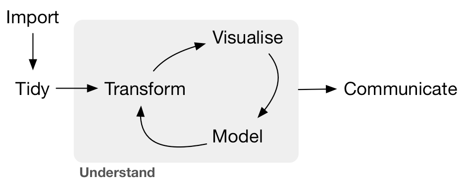
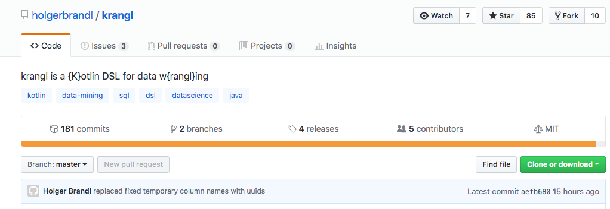
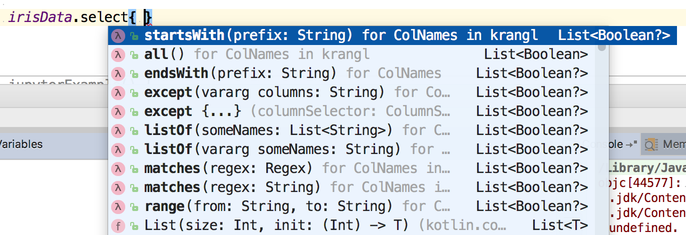
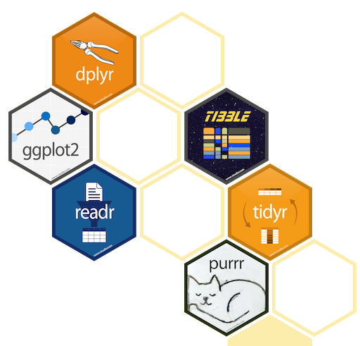
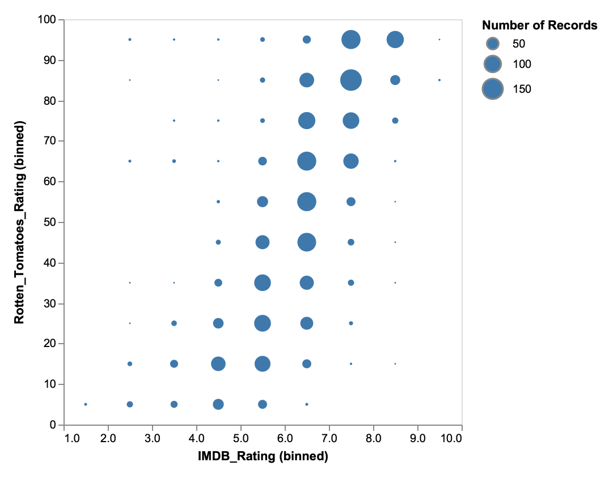
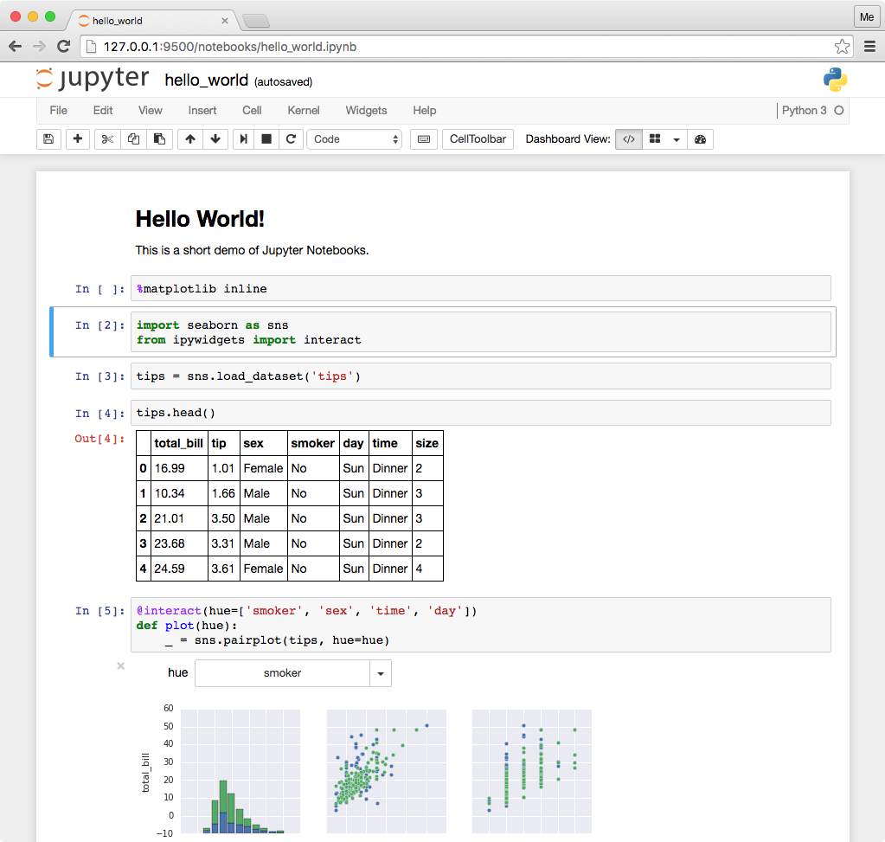
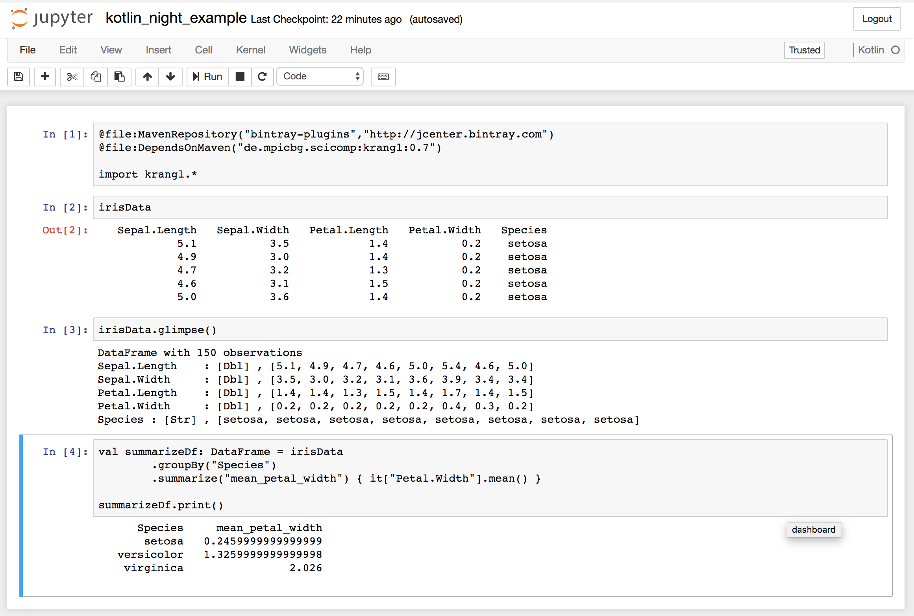
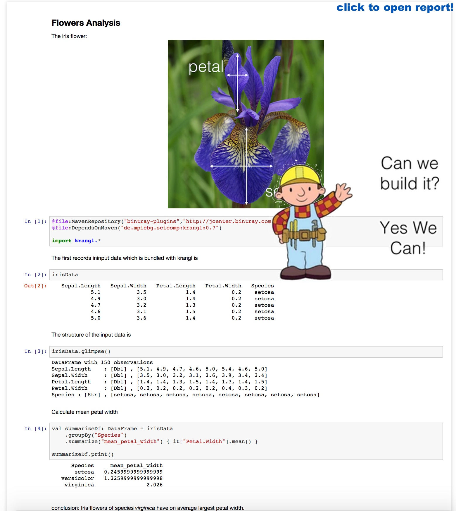

background-image: url(images/gdg_first_slide.png)
background-position: center
background-size: 100%

---
class: middle, inverse

<!-- ## Outline -->
# Outline

### Ingredients for data science?
### Table Wrangling
### Beyond Tables
### Data Visualization
### Reporting & Notebooks

---

class: middle, inverse

### Outline

# Ingredients for data science?
### Table Wrangling
### Beyond Tables
### Data Visualization
### Reporting & Notebooks


---
# The data-science life cycle

.center[]


* Python: `pandas` + `scikit-learn` + `matplotlib`/`seaborn` + `jupyter`
* R: `readr` + `tidyr` + `dplyr` + `ggplot2` + `caret`/`broom` + `knitr`
* JVM, and Kotlin in particular?


???

from https://www.kdnuggets.com/2017/05/42-essential-quotes-data-science-thought-leaders.html
> half hacker, half analyst, they use data to build products and find insights

or
>> Data Scientist (n.): Person who is better at statistics than
any software engineer and better at software engineering than any
statistician.


https://blog.modeanalytics.com/python-data-visualization-libraries/

better package

http://jules32.github.io/2016-07-12-Oxford/dplyr_tidyr

.footnote[
<!-- http://jules32.github.io/2016-07-12-Oxford/dplyr_tidyr -->
https://goo.gl/wfmZrN
]

.footnote[
DSL talk: Frederico Tomasetti
https://github.com/Kotlin/KEEP/issues/75

https://github.com/Kotlin/KEEP/blob/scripting/proposals/scripting-support.md
]


---
background-image: url(images/kotlin_logo.jpg)
background-position: center
background-repeat: no-repeat
background-size: 78%

# Since February 2016

.left-column40[

Kotlin v1.0 released

#### Type Inference
#### Extension Functions
#### Data Classes
#### DSLs in Mind
#### Default Parameters
#### Lives in JVM
#### Scripting Support

]

--

.right-column60[

.right[
Data Science Requirements
## Proper Dependency Model 
## Scales from idea to product 
## Teachable 
## Rapid Prototyping 
]
]

???

somewhen in early 2016 god seemed to have heard our prays, and gave us kotlin.

release day 15.2.

what a beauty!

teachable: less than python or r, but better tooling

So can we build data science libraries with? --> next slide


---
background-image: url(images/java_reading.jpg)
background-position: center
background-repeat: no-repeat
background-size: 90%

# Can we build data science workflows with Kotlin?


Should we? Yes, because

* R & Python fail to be scalable & robust solutions for data science
* Java is known for great dependency tooling & scalability
* Java as a language is less well suited for data-science (cluttered, legacy bits)

For detailed arguments see [kscript @ kotlin-conf slides](https://holgerbrandl.github.io/kscript_kotlinconf_2017/kscript_kotlinconf.html)

--

Language requirements for the data science life cycle
#### 1. Can we express typical data problems and workflows?
#### 2. Can we model core concepts (typed vs untyped data, json, tsv, unstructured)?

--

### So can we?


--

## We wont' know without trying!


---
# Just use the Kotlin stdlib == more gym time!?

* `map`, `fold`, `filter`, `reduce` are cool and fun
* Useful IO utilities like `File.readLines()`
* Great string manipulation helpers
* Great collection API
* Grouping API

```kotlin
data class User(val firstName: String?, val lastName: String, 
                val age: Int, val hasSudo: Boolean?)

val users = listOf(User(...), ...)

val groupingBy : Grouping<User, Int> = users.groupingBy { it.age }

groupingBy.eachCount()

users.groupingBy { listOf(it.age, it.hasSudo) }.map{  ... }.fold{ ... }
```

More advanced slicing possible with https://github.com/thomasnield/kotlin-statistics

### Still, not enough to implement DS life cycle!

???

so apart from the amazing language spec, what is in the stdlib for data science

winter is coming --> summer is coming

.. so another year no beachbody

for details see https://kotlinlang.org/api/latest/jvm/stdlib/kotlin.collections/-grouping/


---
# To type or not to type?

* _Static types_ are cool, but most data has no type
* It's more robust/fun to use types and they allow for better design
* Many data attributes are very fluent

```kotlin
data class Employee(val id:Int, val name:String) 
val staffStats = listOf(Employee(1, "John"), Employee(2, "Anna"))  
    .predictNumSickDays()     // new type!
    .addPerformanceMetrics()  // new type!
    .addSalaries()            // new type!
    .correlationAnalysis()    // odd generic signature :-|
```
* R/python lack static typing, which make such workflows more fluent/fun to write

```r
staff %>% 
    mutate(sick_days=predictSickDays(name)) %>%   # table with another column
    left_join(userPerf) %>%                       # and some more columns
    left_join(salaries) %>%                       # and even more columns
    select_if(is.numeric) %>%                     
    correlate(type="spearman")                    # correlate numeric attributes
```

???

defining types is a tedious process

correlation via: https://github.com/drsimonj/corrr


---
# Check what's out there


* [tablesaw](https://github.com/jtablesaw/tablesaw) which is (according to its authors) the _The simplest way to slice data in Java_
* [kotliquery](https://github.com/seratch/kotliquery) is a handy database access library
* [Scala DataTable](https://github.com/martincooper/scala-datatable): a lightweight, in-memory table structure written in Scala
* [joinery](https://github.com/cardillo/joinery) implements data frames for Java
* [paleo](https://github.com/netzwerg/paleo) which provides immutable Java 8 data frames with typed columns
* [morpheus-core](https://github.com/zavtech/morpheus-core) which is a data science framework implementing an R-like data-frame for the JVM
* [vectorz](https://github.com/mikera/vectorz) is a fast and flexible numerical library for Java featuring N-dimensional arrays
* [koma](https://kyonifer.github.io/koma/) is a scientific computing library written in Kotlin
* [termsql](https://github.com/tobimensch/termsql) converts text from a file or from stdin into SQL table using sqlite and query it instantly
* [Dex : The Data Explorer](https://github.com/PatMartin/Dex) is a data visualization tool written capable of powerful ETL and reporting


### Great stuff, but does not really include we want here!


---
# Wanted: Mix typed and untyped data

`val dataFrame : DataFrame =`

| `employee:Employee` | `sales:List<Sale>` | `age:Int` | `address:String` | `salary:Double`   |
|:-----|:-------------|:----|:-----|:--|
| `Employee(23, "Max")` |    `listOf(Sale(...), Sale())` |   23  | "Frankfurt"     |  50.3E3 |
| ... |  ...    | ...    |  ...    | ...  |

```kotlin
// aggregations like
dataFrame.groupBy("age").count()
dataFrame.summarize("mean_salary"){ mean(it["salaray"])}

// integration like
val df: DataFrame = dataFrame.leftJoin(otherDF)

// transformations like
dataFrame.addColumn("intial"){ it["employee"].map<Employee>{ it.name.first() }}
```

`+` `pandas`/`tidyverse` like API to create, manipulate, reshape, combine and summarize  data frames

`+` methods to go back and forth between untyped and typed data


???

1st part: comparably straightforward, just look how the others do it
2nd: dive into reflection API

assess if it would by any fun to work with such an API!


---
class: inverse

# `krangl`

.center[]

`krangl` is a {K}otlin library for data w{rangl}ing. By implementing a grammar of data manipulation using a modern functional-style API, it allows to filter, transform, aggregate and reshape tabular data.

Tries to become what pandas is for `python`, and `readr`+`tidyr`+`dplyr` are for R

???

Rather ambitious goal goal


---
# Data model of `krangl`


What is a DataFrame?

> A "tabular" data structure representing cases/records (rows), each of which consists of a number of observations or measurements (columns)


```kotlin
interface DataFrame {
    val cols: List<DataCol>
}

abstract class DataCol(val name: String) {
    abstract fun values(): Array<*>
}
```
* Implemented as column model to allow for vectorization where possible
* Column implementations for `String?`, `Int?`, `Double?`, `Boolean?` and `Any?`
* Internal length and type consistency checks (e.g. prevent duplicated column names)

???

Approached it from a naive forward orientied perspective

colleagues: "Holger, work with vectors or you'll end up in hell"

Nullable types core concept of Kotlin !!

Def from https://github.com/mobileink/data.frame/wiki/What-is-a-Data-Frame%3F

---
# Get your data into krangl


Read from tsv, csv, json, jdbc, e.g.
```kotlin
val users = dataFrameOf(
    "firstName", "lastName", "age", "hasSudo")(
    "max", "smith" , 53, false,
    "eva", "miller", 23, true,
    null , "meyer" , 23, null)
 
val tornados = DataFrame.readCSV(pathAsStringFileOrUrl)
tornados.writeCSV(File("tornados.txt.gz"))
```

* Guess column types & default parameters
* Built-in missing value support

Convert any iterable into a data-frame via extension function + reflection

```kotlin
data class Person(val name:String, val address:String)
val persons : List<Person> = ...

val personsDF: DataFrame = persons.asDataFrame() 
```

???

low hanging fruits first --> the easy part

try to match kotlin wording `dataFrameOf`

---
# Kotlin Basics Revisited: Function literals

> A _lambda expression_ or an anonymous function is a _function literal_, i.e. a function that is not declared, but passed immediately as an expression.

```kotlin
fun lazyMsg(condition: Boolean, msg: (Date) -> String) {
    if (condition) println(msg(Date()))
}

lazyMsg(true, { occurred -> "huhu + ${occurred}"})
```

--

If a function literal has only _one_ parameter, its declaration may be omitted and its name will be `it`.

```kotlin
lazyMsg(true){ "huhu ${it}" }
lazyMsg(true){ "huhu" } // .. or ignore it
```

--

If the _last_ parameter to a function is a function, and you're passing a lambda expression as the corresponding argument, you can specify it outside of parentheses.

```kotlin
lazyMsg(true){ "huhu ${it}" }
```

???

to make sure that everyone is on same page, here ....

`msg` is supposed to be a function that takes a `Date` argument and returns a value of type `String`.

cool, but kotlin goes even further

`it`: implicit name of a single parameter


For full details see  https://kotlinlang.org/docs/reference/lambdas.html

---
## Build an API with type aliases + extensions + lambdas

Envisioned user API for `krangl`
```kotlin
val newDf   = staff.addColumn("age_plus_3") { it["age"] + 3 }
val otherDF = staff.addColumn("row_number") { rowNumber }
```

--

Behind the scenes
```kotlin
fun DataFrame.addColumn(columnName: String, expression: TableExpression): DataFrame = 
    addColumn(ColumnFormula(columnName, expression))

// typealias TableExpression = DataFrame.(DataFrame) -> Any? // .. in first prototype, now:
typealias TableExpression = ExpressionContext.(ExpressionContext) -> Any?

class ExpressionContext(val df: DataFrame) {
    operator fun get(name: String): DataCol = df[name]

    val rowNumber: List<Int> get() = (1..df.nrow).toList()
}
```

* `it` in examples is instance of `ExpressionContext` proxying the `df`
* Allows to refer with `it` and `this` to expression context


???

user perspective `it` is the df, but it is actually not. Just the relevant bits of it

---
# Receivers in function literals provide scope control

Context specific for completion in IDE




---
# How to build a data-frame API?

data model, `readCSV`, `addColumn`, what else do we need?

--

.pull-left[
* Learn from the best.. Learn from the **[`tidyverse`](https://www.tidyverse.org/)**!

* Supported and condensed into amazing [cheatsheets](https://www.rstudio.com/resources/cheatsheets/) by [rstudio](https://www.rstudio.com/)

Major APIs
* `tibble` - Data structures
* `tidyr`  -  Data preparation
* `dplyr`  -  Data manipulation
* `purrr`  -  List Columns & nested tables
]

.pull-right[

]


---
background-image: url(images/tidyr_cs_checked.png)
background-position: center
background-repeat: no-repeat
background-size: 78%


???

r functions defined much more loose in terms argument types, not a simple one-2-one translation

From http://dplyr.tidyverse.org/articles/programming.html

> Most dplyr functions use non-standard evaluation (NSE). This is a catch-all term that means they don't follow the usual R rules of evaluation. Instead, they capture the expression that you typed and evaluate it in a custom way.

Following slides 2 examples: gather + separate

---
# Example: Data Reshaping with `krangl`

```kotlin
val climate = dataFrameOf(
        "city", "coast_distance", "1995", "2000", "2005")(
        "Dresden", 400, 343, 252, 423,
        "Frankfurt", 534, 534, 435, 913)
```

```
     city   coast_distance   1995   2000   2005
  Dresden              400    343    252    423
Frankfurt              534    534    435    913
```

```kotlin
climate. gather("year", "rainfall", columns = { matches("[0-9]*")} )
```

```
     city   coast_distance   year   rainfall
  Dresden              400   1995        343
Frankfurt              534   1995        534
  Dresden              400   2000        252
Frankfurt              534   2000        435
  Dresden              400   2005        423
Frankfurt              534   2005        913
```

???

`colummns` use function literals again, with column names type as receiver

---
# Example: Data Ingestion with `krangl`

```kotlin
dataFrameOf("user")("brandl,holger,37")
        .apply { print() }
        .separate("user", listOf("last_name", "first_name","age"), convert = true)
        .apply { print() }
        .apply { glimpse() }
```

```
            user
brandl,holger,37
```
-----
```
last_name   first_name   age
   brandl       holger    37
```
-----
```
DataFrame with 1 observations
last_name  : [Str]	, [brandl]
first_name : [Str]	, [holger]
age        : [Int]	, [37]
```

---
background-image: url(images/data_trafo_1_cs_checked.png)
background-position: center
background-repeat: no-repeat
background-size: 78%

???

some function intentionally left out, feasabilty prototype first

---
background-image: url(images/data_trafo_2_cs_checked.png)
background-position: center
background-repeat: no-repeat
background-size: 78%


---
background-image: url(images/nested_data_cs_checked.png)
background-position: center
background-repeat: no-repeat
background-size: 78%

???

nested tables exteremly powerful concept.

---
# Add columns with `addColumn`

```kotlin
val df: DataFrame = dataFrameOf(
    "first_name", "last_name", "age", "weight")(
    "Max", "Doe", 23, 55,
    "Franz", "Smith", 23, 88,
    "Horst", "Keanes", 12, 82)

df.addColumn("salary_category") { 3 }             // add constants
df.addColumn("age_3y_later") { it["age"] + 3 }    // do basic column arithmetics

// krangl dataframes are immutable so we need to (re)assign results to preserve changes.
val newDF = df.addColumn("full_name") { it["first_name"] + " " + it["last_name"] }

// krangl overloads  arithmetic operators like + for dataframe-columns
df.addColumn("user_id") { it["last_name"] + "_id" + rowNumber }

//and provides convenience methods to ignore NAs
df.addColumn("first_name_initial") { it["first_name"].map<String>{ it.first() } }

// or add multiple columns at once
df.addColumns(
    "age_plus3" to { it["age"] + 3 },
    "initial" to { it["first_name"].map<String> { it.first() } }
)
```

---
# Get your data in order with `sortedBy`

```kotlin
df.sortedBy("age")

// and add secondary sorting attributes as varargs
df.sortedBy("age", "weight")

// reverse sorting order
df.sortedByDescending("age")
df.sortedBy{ desc("age") }

// sort descending by age, and resolve ties by weight
df.sortedBy({ desc(it["age"]) }, { it["weight"] })


// sort with indicator lambda
df.sortedBy { it["weight"].round() }
```

???

mimic Kotlin stdlib where possible


---
# Subset variables with `select`

```kotlin
// positive selection
df.select("last_name", "weight")    

// negative selection
df.remove("weight", "age")  

// selector mini-language
df.select { endsWith("name") }   
df.select { matches("foo[0-9") }

// functional style column selection
// odd name to avoid JVM signature clash (help welcome!)
df.select2 { it is IntCol } 

// rename columns
df.rename("last_name" to "Nachname")
```

---
# Subset your records with `filter`

```kotlin
// Subset rows with vectorized filter
df.filter { it["age"] eq 23 }
df.filter { it["weight"] gt 50 }
df.filter({ it["last_name"].isMatching { startsWith("Do")  }})

```

In case vectorized operations are not possible or available we can also filter tables by row which allows for scalar operators
```kotlin
df.filterByRow { it["age"] as Int > 5 }
df.filterByRow { (it["age"] as Int).rem(10) == 0 } // "round" birthdays :-)

```

---
# Summarize your data with `summarize`

```kotlin
// do simple cross tabulations
df.count("age", "last_name")

// ... or calculate single summary statistic
df.summarize("mean_age") { it["age"].mean(true) }

// ... or multiple summary statistics
df.summarize(
    "min_age" to { it["age"].min() },
    "max_age" to { it["age"].max() }
)

// for sake of r and python transition you can also use `=` here
df.summarize(
    "min_age" `=` { it["age"].min() },
    "max_age" `=` { it["age"].max() }
)
```
---
# Perform grouped operations after `groupBy`


```kotlin
val groupedDf: DataFrame = df.groupBy("age") 
// ... or provide multiple grouping attributes with varargs

val sumDF = groupedDf.summarize(
    "mean_weight" to { it["weight"].mean(removeNA = true) },
    "num_persons" to { nrow }
)

// Optionally ungroup the data
sumDF.ungroup()
```


---
# Bring it all together

```kotlin
flightsData
    .groupBy("year", "month", "day")
    .select({ range("year", "day") }, { listOf("arr_delay", "dep_delay") })
    .summarize(
        "mean_arr_delay" `=` { it["arr_delay"].mean(removeNA = true) },
        "mean_dep_delay" to  { it["dep_delay"].mean(removeNA = true) }
    )
    .filter { (it["mean_arr_delay"] gt  30)  OR  (it["mean_dep_delay"] gt  30) }
    .sortedBy("mean_arr_delay")
```

```
year   month   day       mean_arr_delay       mean_dep_delay
2013      10    11              18.9229              31.2318
2013       5    24              24.2574              30.3407
2013       6     2               26.075              34.0133
2013       6    26              27.3174             30.61175
2013       6    10              28.0222             30.61945
2013       7     8              29.6488              37.2966
2013       8    22              29.9767              33.6004
2013       2    27               31.252              37.7632
```

???

either `=` or to will go away most likely

---
# Type support - Part 1: Digest objects into attribute columns

Cherry-pick properties with `Iterable<T>.deparseRecords`
```kotlin
val deparsedDF = records.deparseRecords { mapOf(
    "age" to it.age, 
    "weight" to it.mean_weight
) }

```

Be lazy and use reflection
```kotlin
data class Person(val name:String, val age:Int)
val persons :List<Person> = listOf(Person("Max", 23), Person("Anna", 43))

val personsDF: DataFrame = persons.asDataFrame() 
personsDF
```

```
age   name
 23   Max
 43   Anna
```

---
# Type support - Part 2: List/object columns

`krangl` supports arbitrary types per column

```kotlin
val persons: DataFrame = dataFrameOf("person")(persons) 
persons
```

```
                      person
   Person(name=Max, age=23)
   Person(name=Anna, age=43)
```

```kotlin
personsDF2.glimpse()
```

```
DataFrame with 2 observations
person	: [Any]	, [Person(name=Max, age=23), Person(name=Anna, age=43)]
```


---
# Type support - Part 3: Unfold objects into columns

* similar to `separate()` but for object columns


```kotlin
data class Person(val name:String, val age:Int)
val persons :Iterable<Person> = listOf(Person("Max", 22), Person("Anna", 23))

val df : DataFrame = dataFrameOf("person")(persons)

df.names
```
```
["person"]
```
--

Expand properties of `person` into columns via reflection

```kotlin
var personsDF = df.
    unfold<Person>("person", keep=true) 
    // unfold<Person>("person", select=listOf("age"))
    
personsDF.names   
```

```
["person", "name", "age"]
```

---
# Type support - Part 4: Let krangl define the schema


Infer a schema with

```kotlin
irisData.printDataClassSchema("Iris")
```
which makes krangl to __print__ the Kotlin data class schema for data frame:

```kotlin
data class Iris(val sepalLength: Double, val sepalWidth: Double, val petalLength: Double, 
                val petalWidth: Double, val species: String)
                
val records: Iterable<Iris> = irisData.rowsAs<Iris>()
```

Paste it back into workflow code and continue with typed objects!

```kotlin
records.take(1)
```

```
[ Iris(sepalLength=5.1, sepalWidth=3.5, petalLength=1.4, petalWidth=0.2, species=setosa) ]
```


???

grand finale

applicable for interactive workflow only

---
# Bumpy API corners

#### Lists in table formulas cause operator confusion

```kotlin
users.addColumn("age_plus_3") { it["user"].map<User> { it.age } + 3 } // extend list with 3
users.addColumn("age_plus_3") { it["user"].map<User> { it.age + 3 } } // correct
users.addColumn("age_plus_3") { it["age"] + 3 }   // works because `DataCol.plus` can be defined
```

--
#### Incomplete vectorization for operators

Some (`+`, `-`, `*`, `!`) can be overridden for collections, but others cannot (e.g. all arithmetic and boolean comparison ops)

No vectorization for `>`,  `&&` `==`, etc. in table forumlas → Use function calls or not so pretty `gt`, `AND`, `eq`, etc.


--
#### Receiver vs parameter functions vs properties

How to write vector utilties?

```
dataFrame.summarize("mean_salary") { mean(it["salaray"]) }    // function parameter 
dataFrame.summarize("mean_salary") { it["salaray"].mean() }   // extension/member function
dataFrame.summarize("mean_salary") { it["salaray"].mean }     // extension property
```

???

Don't overload `operator Any?.plus` --> Confusion

https://kotlinlang.org/docs/reference/operator-overloading.html

---
# Quo vadis `krangl`?

Promising API, great learning experience.

--

Project still in flux towards a convenient and consistent API design

--

Next steps

* Date column support
* Better lambda receiver contexts
* Performance (indices, avoid list and array copies, compressed columns)
* Use dedicated return type for table formula helpers (like `mean`, `rank`) to reduce runtime errors
* More bindings to other jvm data-science libraries
* Better documentation & cheatsheets
* `Sequence` vs `Iterable`?
* Pluggable backends like native or SQL

--

### Feel welcome with PRs, ideas, bug reports at https://github.com/holgerbrandl/krangl

---
class: middle, inverse

### Outline

### Ingredients for data science?
### Table Wrangling
# Beyond Tables
### Data Visualization
### Reporting & Notebooks


---
# Beyond Tables

### 90% of Data Science is *just* table integration!

--

But still we want to do

### * Data Visualization
### * Statistics
### * Regression & Classification


--
Today, just pointers!

Great link collection: https://github.com/thomasnield/kotlin-data-science-resources


---
background-image: url(images/ggplot_examples.png)
background-position: center
background-repeat: no-repeat
background-size: 95%


# Data Visualization

Many options

* [Vegas](https://github.com/vegas-viz/Vegas) Vega-lite wrapper, aims to be the missing MatPlotLib for Scala + Spark
* [data2viz](https://github.com/data2viz/data2viz) is a multi platform data visualization library with comprehensive DSL
* [XChart](https://github.com/timmolter/XChart) is a light-weight Java library for plotting data
* [Kubed](https://github.com/hudsonb/kubed/) is a Kotlin library for manipulating the JavaFX scenegraph based on data.
* [TornadoFX](https://github.com/edvin/tornadofx/wiki/Charts) provides some Kotlin wrappers around JavaFX
* [Jzy3d](http://www.jzy3d.org/) is an open source java library that allows to easily draw 3d #surfaces, scatter plots, bar charts
* [plotly-scala](https://github.com/alexarchambault/plotly-scala) which provides scala bindings for plotly.js and works within jupyter
* [grafana](https://grafana.com/) is an open platform for beautiful analytics and monitoring

--

#### 1. Still no coherent `ggplot2` like framework with grammar for graphics

> `layers` + `aesthetics` + `coordinates system` + `transformations` + ` facets`

--

#### 2. JVM graphics device project that works from Kotlin REPL, in Intellij, and in jupyter notebooks

???

`one or more layers` + `map variables from data space to visual space` + `coordinates system` + `statistical transformations` + `optional facets`


---
# `kravis` - https://github.com/holgerbrandl/kravis

Early pre-alpha!! :-)

`kravis` implements a grammar to create a wide range of plots using a standardized set of verbs.

It implements a Kotlin DSL wrapper around [vega-lite](https://vega.github.io/vega-lite/):


.left-column60[

```kotlin
import krangl.*
import kravis.*

val movies = DataFrame.fromJson("movies.json")

plotOf(movies) {  mark = Mark(circle)
 
 encoding(x,"IMDB_Rating",binParams=BinParams(10))
 encoding(y, "Rotten_Tomatoes_Rating", bin = true)
 encoding(size, aggregate = Aggregate.count)
}
```

]

.right-column40[

]

---
# krangl + smile + kravis


```kotlin
val irisArray = irisData.remove("Species").toArray()

val pca = smile.projection.PCA(irisArray)

//barchart
plotOf(pca.varianceProportion.toList()) {
    encoding(x) { this }
}.render()


val projection = pca.setProjection(2).projection

// PC1 vs PC2 scatter
plotOf(projection.transpose().array().withIndex()) {
    mark(MarkType.point)
    encoding(x) { value[0] }
    encoding(y) { value[1] }
    encoding(text){ "PC"+index}
}.render()
```


---
# Regression & Classification: https://github.com/haifengl/smile

* **Classification** Support Vector Machines, Decision Trees, AdaBoost, Gradient Boosting, Random Forest, Logistic Regression, Neural Networks, RBF Networks, Maximum Entropy Classifier, KNN, Naïve Bayesian, Fisher/Linear/Quadratic/Regularized Discriminant Analysis.

* **Regression** Support Vector Regression, Gaussian Process, Regression Trees, Gradient Boosting, Random Forest, RBF Networks, OLS, LASSO, Ridge Regression.

* **Feature Selection** Genetic Algorithm based Feature Selection, Ensemble Learning based Feature Selection, Signal Noise ratio, Sum Squares ratio.

* **Clustering** BIRCH, CLARANS, DBScan, DENCLUE, Deterministic Annealing, K-Means, X-Means, G-Means, Neural Gas, Growing Neural Gas, Hierarchical Clustering, Sequential Information Bottleneck, Self-Organizing Maps, Spectral Clustering, Minimum Entropy Clustering.

* **Manifold learning** IsoMap, LLE, Laplacian Eigenmap, t-SNE, PCA, Kernel PCA, Probabilistic PCA, GHA, Random Projection, MDS

* **Nearest Neighbor Search** BK-Tree, Cover Tree, KD-Tree, LSH.

* **Sequence Learning** Hidden Markov Model, Conditional Random Field.

* **Natural Language Processing** Tokenizer, Keyword Extractor, Stemmer, POS Tagging, Relevance Ranking

???


https://deeplearning4j.org/

kotlin examples

https://github.com/deeplearning4j/dl4j-examples/blob/master/dl4j-examples/src/main/kotlin/org/deeplearning4j/examples/feedforward/mnist/MLPMnistSingleLayerExample.kt


---
# Statistics

http://commons.apache.org/proper/commons-math/ and https://github.com/chen0040/java-glm

Example: How to fit a linear regression model per group?

```kotlin
val irisModel = irisData
    .groupBy("Species")
    .summarize("lm") {
        val x = it["Sepal.Length"].asDoubles().filterNotNull().toDoubleArray()
        val y = it["Sepal.Width"].asDoubles().filterNotNull().toDoubleArray()

        val xTransposed = MatrixUtils.createRealMatrix(arrayOf(x)).transpose().data
        SimpleRegression().apply { addObservations(xTransposed, y) }
    }
    .unfold<SimpleRegression>("lm", properties = listOf("intercept", "slope"))
```
```
   Species                                                                   lm       slope   intercept
    setosa   org.apache.commons.math3.stat.regression.SimpleRegression@66133adc       0.798     -0.5694
versicolor   org.apache.commons.math3.stat.regression.SimpleRegression@7bfcd12c       0.319      0.8721
 virginica   org.apache.commons.math3.stat.regression.SimpleRegression@42f30e0a       0.2318      1.446
```

---
class: middle, inverse

### Outline

### Ingredients for data science?
### Table Wrangling
### Beyond Tables
### Data Visualization
# Reporting & Notebooks


---

## 

.left-column60[
> Open-source web application that allows you to create and share
  documents that contain live code, equations, visualizations and narrative text.

Pros
* Fast prototyping
* Literate Programming
* Great Narrative
* Shareable insights without build process

Cons
* Collaboration is tricky
* Versioning and code reviews are hard
* Webapp not a real IDE substitute -> JupyterLab
]

.right-column40[


]

???

Very popular framework that is "Super-Charging Data Science"


https://www.quora.com/What-are-the-pros-and-cons-of-using-Python-Jupyter-versus-a-normal-Python-development-environment

https://unidata.github.io/online-python-training/introduction.html

---
# Kotlin Notebooks?

> A kernel provides programming language support in Jupyter. IPython is the default kernel. Additional kernels include R, Julia, and many more.

Two competing kernels for Kotlin

1. https://github.com/ligee/kotlin-jupyter

    * More established
    * Backed by JB
    * Friendly and responsive developers
    * Not really active

2. https://github.com/twosigma/beakerx

    > a collection of JVM kernels and interactive widgets for plotting, tables, auto-translation, and other extensions to Jupyter Notebook.

    * Very active, fast progress
    * Friendly and very responsive developers
    * Not __just__ a kernel
    * Display handler registry in kernel `krangl.beakerx.TableDisplayer.register()`

???

beakerx: adapaters for tablesaw https://github.com/jtablesaw/tablesaw/tree/master/beakerx and morpheus

---



???

Definietly cool, but lacks effieciency because of missing tooling (error checking, compeltion, refactoring)

---

background-image: url(images/spin_workflow.jpg)
background-position: bottom
background-size: 95%

# Literate programming: Turn code into reports

Enable result consistency and streamline communication by <br>
building reports from code

1. Develop data workflows interactively using plain and simple code
2. Build reports embedding code and results


Python:  markdown -> `notedown` + `nbconvert`

R: R scripts --> `spin` -> `knit` -> `pandoc`

--

## Can we do this with Kotlin?


???

R ->  (**Speakers choice!**)

*  IDE markdown support very good
*  Kotln code chunk support not usable


---

```kotlin
//' ## Flowers Analysis

//' The iris flower
//' 

@file:MavenRepository("bintray-plugins","http://jcenter.bintray.com")
@file:DependsOnMaven("de.mpicbg.scicomp:krangl:0.7")

import krangl.*


//' The first records in the input data (which is bundled with krangl) are
irisData

//' The structure of the input data is
irisData.glimpse()

//' Calculate mean petal
val summarizeDf: DataFrame = irisData
    .groupBy("Species")
    .summarize("mean_petal_width") { it["Petal.Width"].mean() }

//' Print the summarized data
summarizeDf.print()

//' Conclusion: Iris flowers of species _virginica_ have on average the largest petal width.
```


---
# `kts->html` converter

```bash
inputScript=krangl_example_report.kts
reportName=$(basename $inputScript .kts)

# https://www.r-project.org/
Rscript - ${inputScript} <<"EOF"
knitr::spin(commandArgs(T)[1], doc = "^//'[ ]?", knit=F)
EOF

# https://github.com/holgerbrandl/kscript
kscript -t 'lines.map { it.replace("{r }", "")}.print()' ${reportName}.Rmd > ${reportName}.md

# https://github.com/aaren/notedown
notedown ${reportName}.md > ${reportName}.ipynb

# http://jupyter.org/install
jupyter nbconvert --ExecutePreprocessor.kernel_name=kotlin \
        --execute --to html ${reportName}.ipynb --output ${reportName}
```

Proof-of-Concept. :-)

All but the last step could be reworked into a standalone tool.

???

the geeky corner

Alternative approaches?

---

<a href="./krangl_example_report.html" rel="some text"></a>


???

Feels like the holy grail for reproducible research. Strict dependency model, literate programming, amazing modern language. Let's go for it!

What do we need is coding environment! Next 20 slides, VIMs kotlin language pack, 10 build sources, 10 installation process.

... Kidding:

---

background-image: url(images/the_ide.png)
background-position: center
background-size: 88%


---

background-image: url(images/bugs.png)
background-position: center
background-size: 100%

# Is **THE** IDE ready for Kotlin data sciene?

Almost.

--

`kts` support not yet ready for prime time

* [KT-11618](https://youtrack.jetbrains.com/issue/KT-11618) Dependencies are ignored in .kts files
* [KT-15019](https://youtrack.jetbrains.com/issue/KT-15019) Editor: `args` reference in .kts file is red
* [KT-6928](https://youtrack.jetbrains.com/issue/KT-6928) Support Kotlin scratch files
* [KT-11473](https://youtrack.jetbrains.com/issue/KT-11473) Allow debugging of Kotlin scripts

--

REPL needs more work

* [KT-11409](https://youtrack.jetbrains.com/issue/KT-11409) Add action "Send Selection To Kotlin Console"
* [KT-7100](https://youtrack.jetbrains.com/issue/KT-7100) REPL: allow adding a library to the classpath
* [KT-14851](https://youtrack.jetbrains.com/issue/KT-14851) "this" is always defined in Kotlin REPL
* [KT-21224](https://youtrack.jetbrains.com/issue/KT-21224 ) Incorrect alignment of commands and outputs in REPL

--

No graphics device

--

### Raise your voice and vote on https://youtrack.jetbrains.com

???

graphics device: extension points + plugin
* Embedded REPL output? dedicated tool window?

Make the world a better place by raising...


kotlin conf rumours about **Data-Science IDE**


other
* [KT-12583](https://youtrack.jetbrains.com/issue/KT-12583) IDE REPL should run in project root directory


---
class:  inverse

# Summary


###  `krangl` is a {K}otlin library for data w{rangl}ing. It allows to filter, transform, aggregate and reshape tabular data.

--

### There's a fascinating JVM data science ecosystem out there, ready to be unleashed on your data

--

### Most wanted: Consistent and versatile visualization API for Kotlin/JVM

--

### Tooling is still evolving!

--

##### **Thanks to Kotlin and IDE team @JetBrains, github community, R/tidyverse community, <br>Scientific Computing Facility @ Max Planck Institute of Molecular Cell Biology and Genetics**

Slides Repo: https://github.com/holgerbrandl/kotlin4ds_kotlin_night_frankfurt

???

`krangl` tries to bring pandas/dplyr to Kotlin

Keep working with github community on [krangl](https://github.com/holgerbrandl/krangl), kravis & [kscript](https://github.com/holgerbrandl/kscript)
